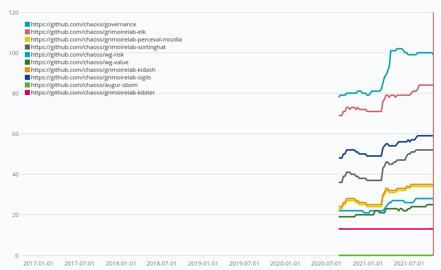

# Technical Forks
Question: What are the number of technical forks of an open source project on
code development platforms?

A technical fork is a distributed version control copy of a project. The number
of technical forks indicates the number of copies of a project on the same code
development platform.

Note: Many times technical fork and clones are used interchangeably, but there
is a difference between the two. A technical fork is a copy of a repository on
the same platform, whereas a clone is a copy on a local machine.

### Objectives
The objective of the Technical Fork metric is to ascertain how many copies of a
project exist on a code development platform. Analysis of technical forks may
provide insight into forking intentions (different types of forks such as
contributing, and non-contributing forks).

### Visualization

#### Steps

1. Click on the `Visualize` option in the sidebar and click on `+` to pick your
   visualization type. Choose `Timelion` as visualization type.

2. Set the `Interval` to `1M` which means 1 month.

3. Set the following Timelion Expression

```
.es(index=github_repositories, 
    timefield=grimoire_creation_date,  
    split=origin:10, 
    metric=max:forks_count)
.label("$1", "^.* > origin:(\S+) > .*")
```

4. In the end, you should see the something similar to the following
   visualization depending on the repositories you have.

    


