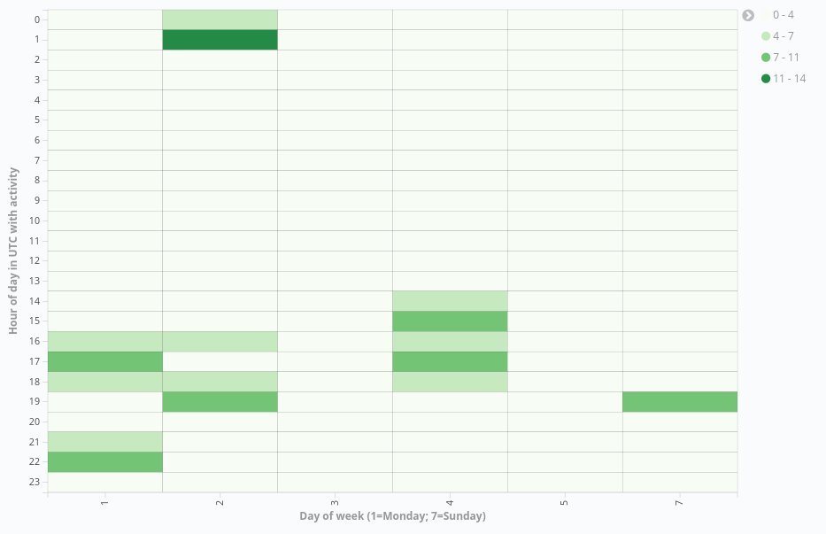

# Activity Dates and Time
Question: What are the dates and timestamps of when a contributor activities occur ?

Individuals engage in activities in open source projects at various times of the day. This metric is aimed at determining the dates and times of when individual activities were completed. The data can be used to probabilistically estimate where on earth contributions come from in cases where the time zone is not UTC.

### Visualizations

#### Number of contributions (times and days)

##### Steps
- For `metrics` set the aggregation to `Unique Count` and field to `hash`.

   

- For `buckets` set the aggregation to `Terms` and field to
  `utc_author_date_weekday`. Set the order to `Ascending` and size to `7` for 7
  days a week.

   

- Right now, if you press the play button, you should be seeing the following
   visualization. Note: The values might not be similar but that's ok.

   

- Now we need to filter according to time as well. In `Buckets` itself, set up
   the Y-axis with a sub-aggregation of `Terms` and field of
   `utc_author_date_hour`. Set the order to ascending and the size to `24` for
   24 hours. 
   
   

- Press the play button and you should see something similar.

   
