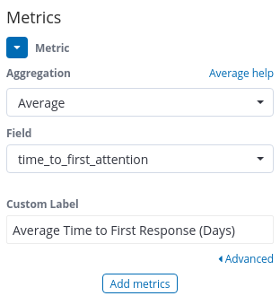
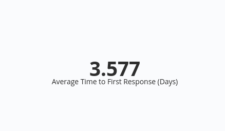

# Time to First Response
Question: How much time passes between when an activity requiring attention is
created and the first response ?

The first response to an activity can sometimes be the most important response.
The first response shows that a community is active and engages in
conversations. A long time to respond to an activity can be a sign that a
community is not responsive. A short time to respond to an activity can help to
engage more members into further discussions and within the community.

### Visualizations

### Average time (in days) for first reponse

### Steps
- For `Metrics` set the aggregation to `Average` and field to `time_to_first_attention`

    

- This visualization does not require any changes in `Buckets`.

    