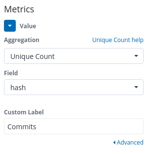
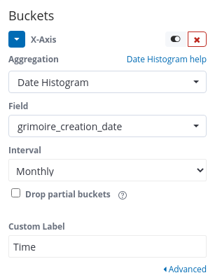
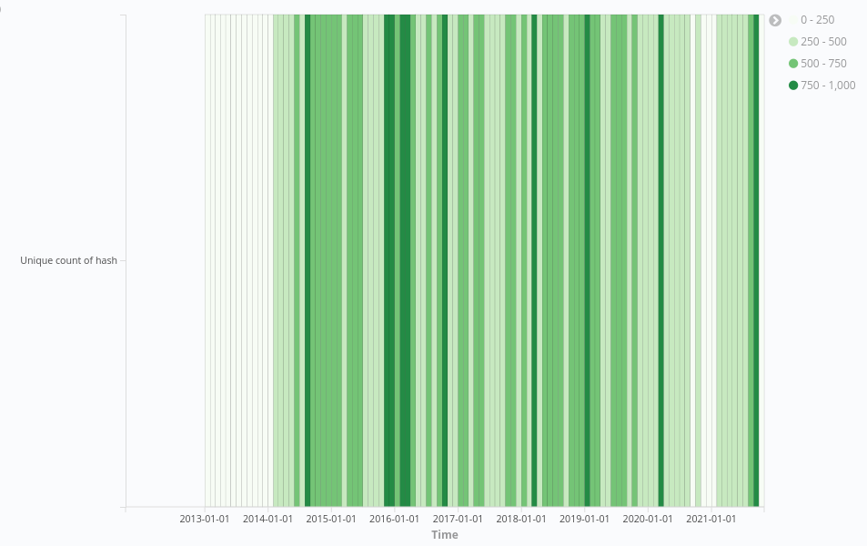

# Bustiness
Question: How are short timeframes of intense activity, followed by a
corresponding return to a typical pattern of activity, observed in a project ?

There are a number of reasons that may prompt a sudden increase or decrease in
the amount of activity within a repository. These increases and decreases appear
both as a sudden change in activity against the average amount of activity.
Burstiness is a way of understanding the cycle of activity in existing metrics,
like issues, merge requests, mailing lists, commits, or comments. Examples of
root causes for bursts in activity include:

- Release cycles
- Global pandemics
- Hackathon activities
- Mentorship programs
- Conferences, meetups, and other events where tools are presented
- Conventional and social media announcements and mentions
- Critical bugs as raising awareness and getting people’s attention
- Community design meetings or brainstorming meetings to address a particular
  issue
- Community members show up from another community that is relying on your
  project (e.g., dependencies)

### Visualization

#### Steps
- For `metrics` set the aggregation to `Unique Count` and field to `hash`.

    

- For `Buckets`, set the aggregation to `Date Histogram` for `X-axis` and field
  `grimoire_creation_date`. Set the interval to whiever you like. I'll use
  `monthly` for this example.

  

- Once you have the above done, click on the play button and you should see
  something similar to the following.

    
