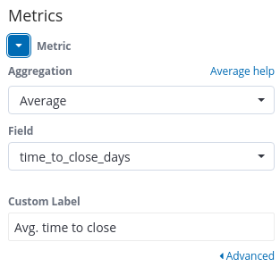
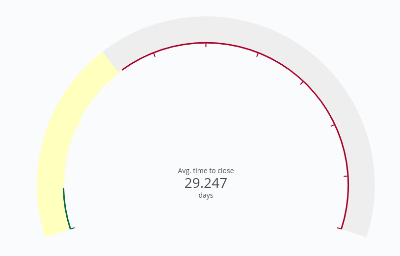
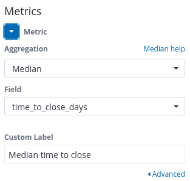
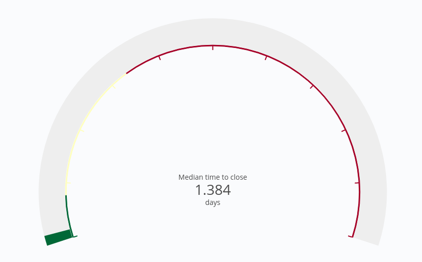

# Time to close
Question: How much time passes between creating and closing an operation such as
an issue, change request, or support ticket ?

### Description

The time to close is the total amount of time that passes between the creation
and closing of an operation such as an issue, change request, or support ticket.
The operation needs to have an open and closed state, as is often the case in
code review processes, question and answer forums, and ticketing systems.

### Visualizations

### Average time to close

#### Steps
- For `metrics` set the aggregation to `Average` and the field to `time_to_close_days`.

    

- This visualization does not require any changes in `Buckets`.

    

### Median time to close

#### Steps
- For `metrics` set the aggregation to `Average` and the field to `time_to_close_days`.

    

- This visualization does not require any changes in `Buckets`.

    
