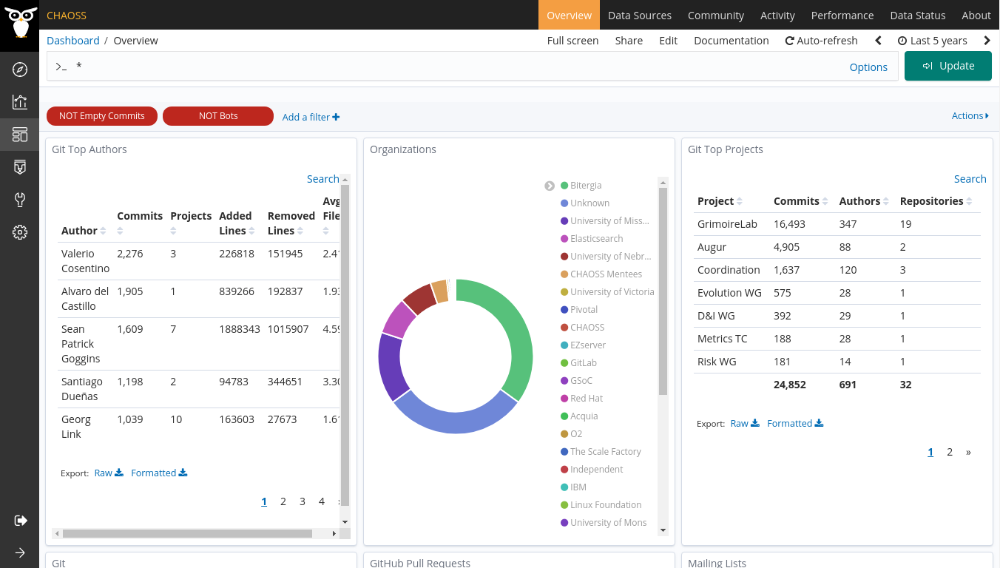
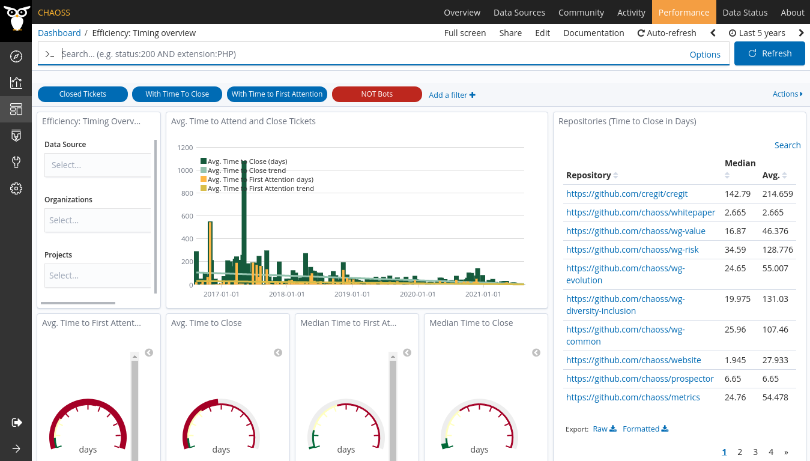
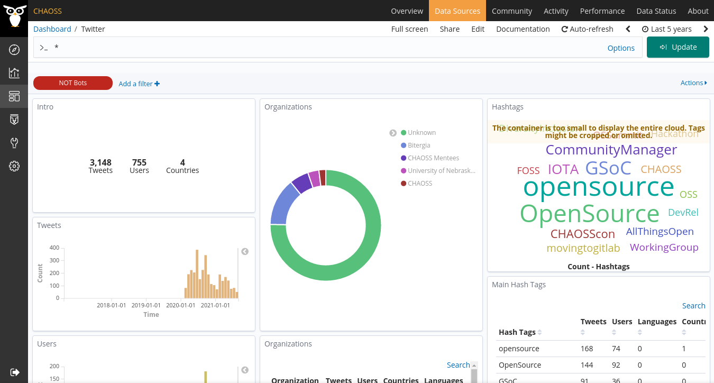

# Creating and Editing Dashboards

Before dealing with actions such as editing and creating dashboards, we need to understand
what is a dashboard.

A dashboard is a collection of visualizations, usually centered around the dashboard
itself to evaluate a certain aspect of the community. For example, lets take the [CHAOSS
GrimoireLab dashboard](https://chaoss.biterg.io/)

If you take a look at the top bar, you'll find all the dashboard used by CHAOSS to
evaluate the state of their projects and community (`Overview`, `Data Sources`, `Community`).

### Overview Dashboard

### Efficiency Dashboard

### Twitter Dashboard

