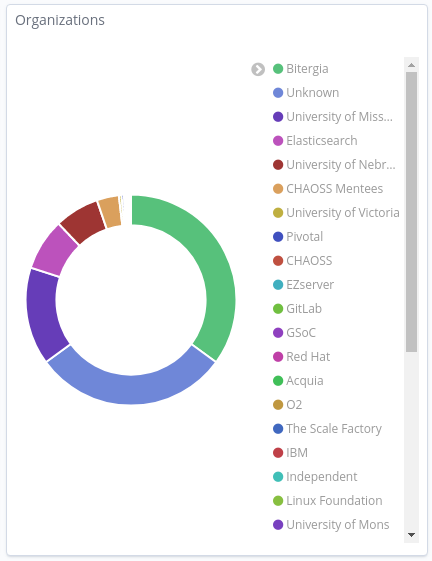
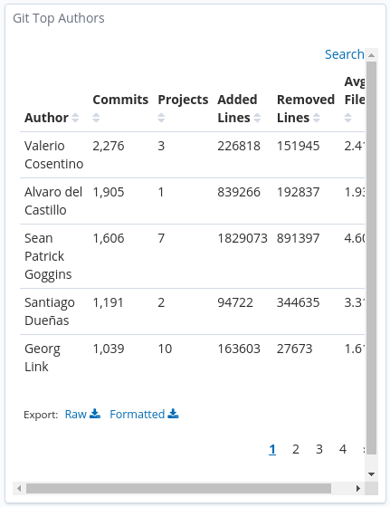

# What is a dashboard ?

I assume that some people might be confused with the difference between this section and
the previous one. Let's clear this misunderstanding.

**Dashboard** - refers to panels in GrimoireLab. Panels refer to each individual
visualization in GrimoireLab. We'' be using the term `Dashboard` instead of panel.

**Dashboards** - refers to the collection of all those dashboard (panels) to make one big
entity knowns as dashboards.

For example, let's take the [CHAOSS GrimoireLab Dashboards](https://chaoss.biterg.io/) as
an example. The following screenshots represent the dashboard used in GrimoireLab.

    

        <h3>Organisations Dashboard</h3>
        
    

    

        <h3>Git Top Authors Dashboard</h3>
        
    

