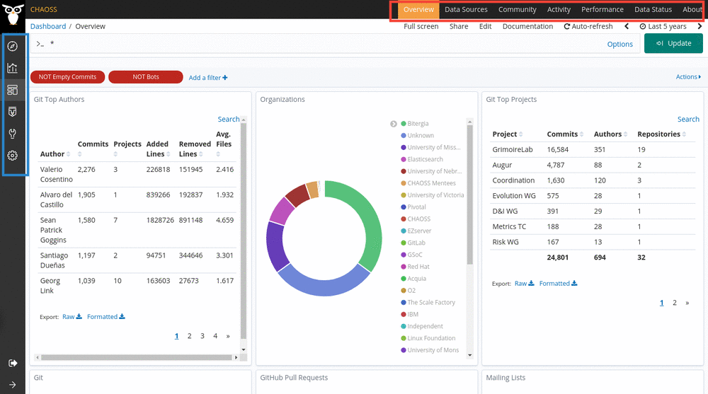

# Dashboard

The GrimoireLab dashboard is where you can evaluate the health of your community based on the visualizations provided. You can also create your own visualization and add it to your dashboard to monitor an aspect of your community. You can also have multiple dashboard to evaluate different aspect of your project.

In this section, we are using the GrimoireLab dashboard to give a brief overview of what functionalities the latter offers.

### GrimoireLab Dashboard

