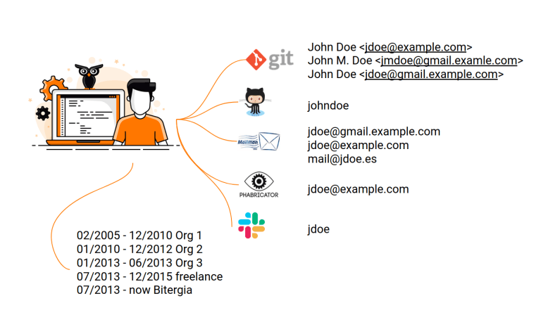

# Difference between profiles and identities

Each individual will have a unique profile which may or may not consists of several identities. A profile is unique to one particular individual, that is no-one will have the same profile with the same information (Name, Email, Username, Affiliations etc... )

For example, you can think of <strong>profiles as human beings</strong>. Every human being is different, hence unique. If that person goes to the bank and creates an account, he'll be given an account card. That is one of his identities, a customer of the bank.

  

The above image further explains the difference between profiles and identities.

As you can see, there is a single individual and that individual has several identities which are listed below

- <strong>Git</strong> 
  Username: John Doe, John M. Doe
  Email: jdoe@example.com, jmdoe@gmail.examle.com, jdoe@gmail.example.com

- <strong>Github</strong> 
  Username: johndoe

- <strong>Mailman</strong> 
  Emails: jdoe@gmail.example.com, jdoe@example.com, mail@jdoe.es

- <strong>Phabricator</strong> 
  Email: jdoe@example.com

- <strong>Slack</strong> 
  Username: jdoe
