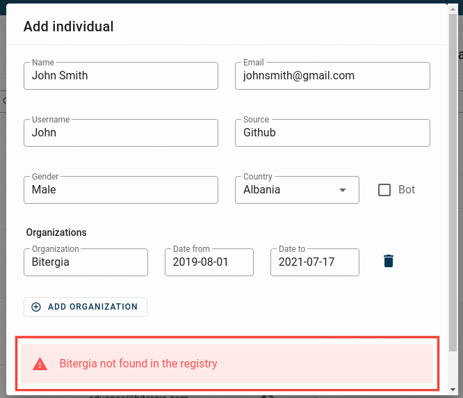
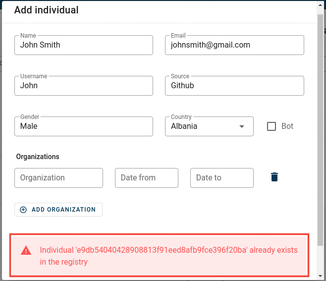
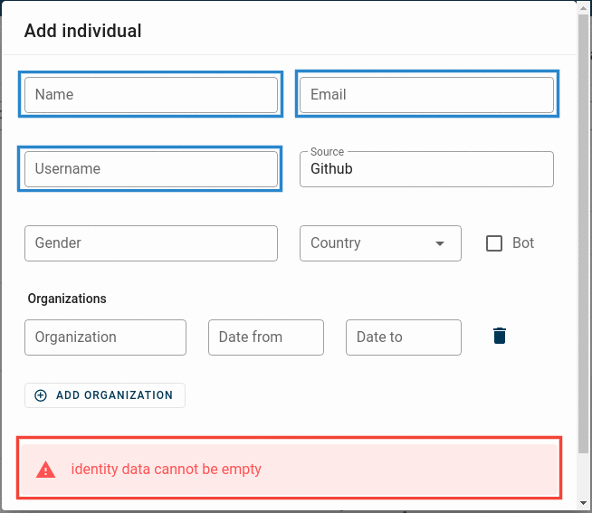

# Troubleshooting steps

### Profile creation issues

- <strong>Organisation not found</strong>  
  

The above issue arises when the organisation submitted does not exist in the `Organisation` table. "Bitergia" here is taken as an example.
In order to fix it, make sure to [add your organisation](https://vsevagen.github.io/grimoirelab-sortinghat/docs/sortinghat/add-org/) first, then [create the individuals profile](https://vsevagen.github.io/grimoirelab-sortinghat/docs/sortinghat/create-profile/). 

- <strong>Profile already exist</strong>  
  
   
  The above issue arises if a existing profile has the exact same information (Name, Email, Username, Source etc...) as the profile being created. The ID `013d8db4d7fba708448c146c8fb54f8dcb974ed1` refers to the unique identifier of a profile.

- <strong>Fields cannot be empty</strong>  
  
   
  The above issue is pretty staightforward. In order to create a profile, a minimum amount of information is required which includes, primarily the <code>Source</code> and any other identity related info (`Name` or `Email` or `Username`).  
