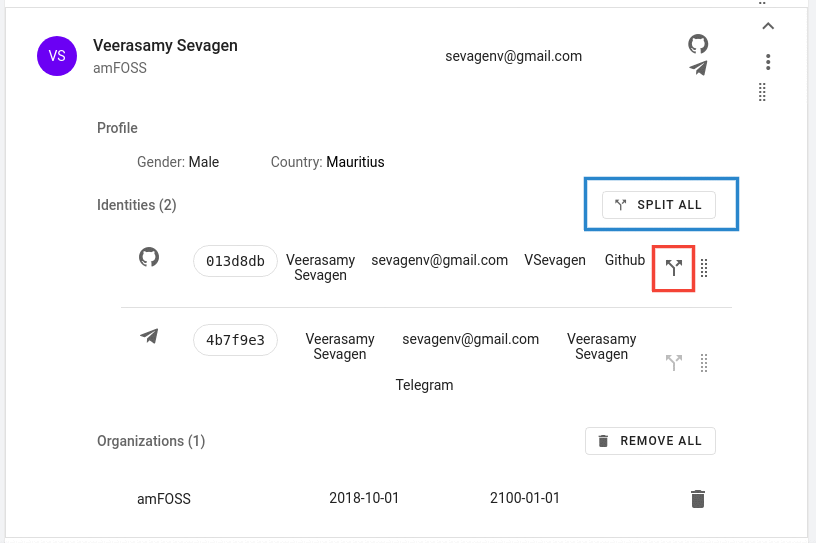

# How to un-merge profiles

SortingHat does provide a way to un-merge profiles and it comes in as the "Split" button which is available in every merged profiles.

- Simply expand the profile where the identity to be un-merged is located. 
    
- You have the option to split all of the identities or specifically pick the identity to be un-merged. 
  
